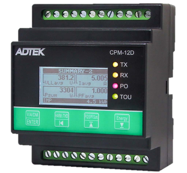
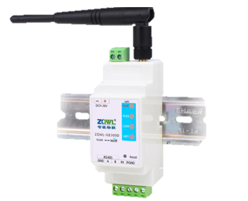
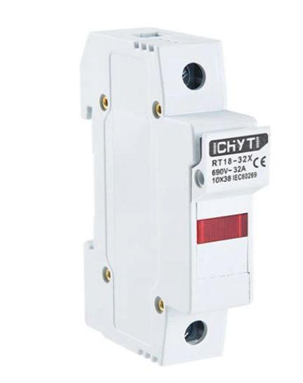
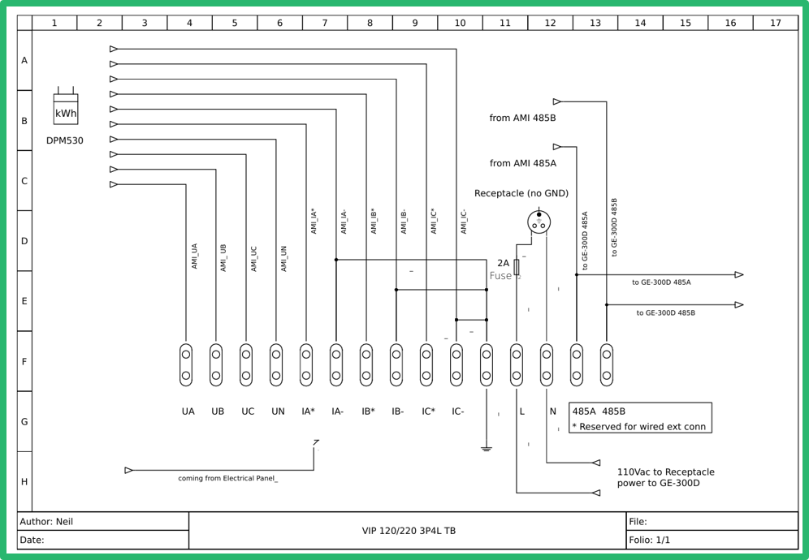
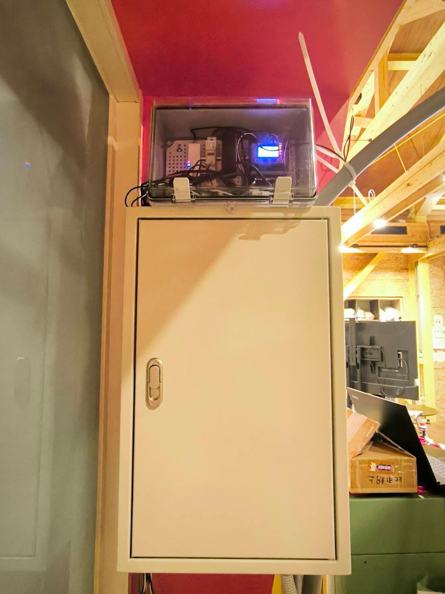
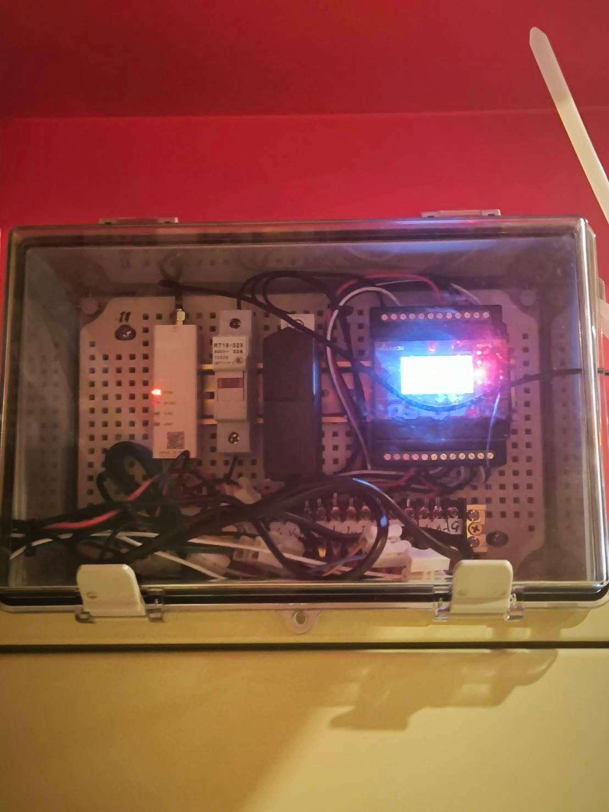

# 🔧 Hardware Overview

This enclosure houses the core components for measuring and transmitting energy data. The setup is securely mounted on a cabinet and designed for stable, long-term monitoring.

## 🔍 Functional Overview

This energy monitoring system is built around a DIN-rail-mounted power meter that measures electrical parameters such as voltage, current, and power. It transmits this data wirelessly to a cloud platform via Wi-Fi. The system is fully enclosed for safety and reliability.

## 🧩 Components & Specifications

| Component | Description |
|----------|-------------|
| **Adtek CPM-12D** | Multifunction power meter for single- and three-phase systems. Measures voltage, current, active/reactive/apparent power, energy (kWh), frequency, and more. Features RS485 Modbus RTU support and an LCD display. Accuracy class 1%. |
| **ZQWL-GE300D** | RS485-to-Wi-Fi gateway used for transmitting Modbus RTU data wirelessly to the cloud. Connects directly to the CPM-12D via RS485 and supports industrial data formats. |
| **RT10-32X Relay (10A)** | Electromagnetic relay used for switching or load simulation. Can be triggered based on sensor data or programmed logic. |
| **DIN Rail Power Supply** | Converts AC mains voltage to regulated DC voltage for powering all components in the enclosure. |
| **Wiring + Terminal Blocks** | Organized electrical connections for signal, control, and power wiring. Mounted on DIN rail for modularity. |
| **Transparent Protective Enclosure** | Wall-mounted casing that protects components while allowing visibility for inspection. |

---

## 📑 Extended Technical Details

### Adtek CPM-12D — Multifunction Power Meter

- **Measurement capabilities:** Voltage, current, frequency, active/reactive/apparent power, power factor, and energy (kWh/kVarh)  
- **Accuracy:** Class 1% for energy readings  
- **Sampling:** 128 points per cycle for true RMS measurement  
- **Communication:** RS485 Modbus RTU, baud rates up to 115200 bps  
- **Display:** LCD screen with buttons, visible in direct sunlight  
- **Data logging:** 2MB flash memory with Time-of-Use (TOU) logging  
- **Supported systems:** 1P2W, 1P3W, 3P3W (1/2/3CT), 3P4W (1/3CT), balanced/unbalanced  
- **Certifications:** CE, FCC, MTBF > 60,000 hours  
- **Extras:** CO₂ emission display, pulse output for external monitoring

---

### ZQWL-GE300D — RS485-to-Wi-Fi Gateway

- **Purpose:** Converts Modbus RTU signals from the CPM-12D into Wi-Fi-based TCP or MQTT messages for cloud integration  
- **Connectivity:** RS485 input, 2.4GHz Wi-Fi output  
- **Protocols:** Modbus RTU → Wi-Fi bridge  
- **Use case:** Industrial IoT, remote energy monitoring  
- **Form factor:** DIN-rail compatible

---

## 🖼️ System Images

### Full Enclosure Setup

### Power Meter: Adtek CPM-12D  
  
> Multifunction power meter that measures voltage, current, and power.

---

### Communication Dongle: ZQWL-GE300D  
  
> RS485-to-Wi-Fi dongle used to transmit power meter data to the cloud.

---

### Relay: RT10-32X  
  
> Relay used for switching or load simulation in the system.

---

### Wiring Diagram
  
>  Wiring and system layout

---

> Wall-mounted view of the transparent protective enclosure housing all components.

---

### Internal Wiring & Components

> Close-up of internal wiring and DIN-rail mounted modules.

---

