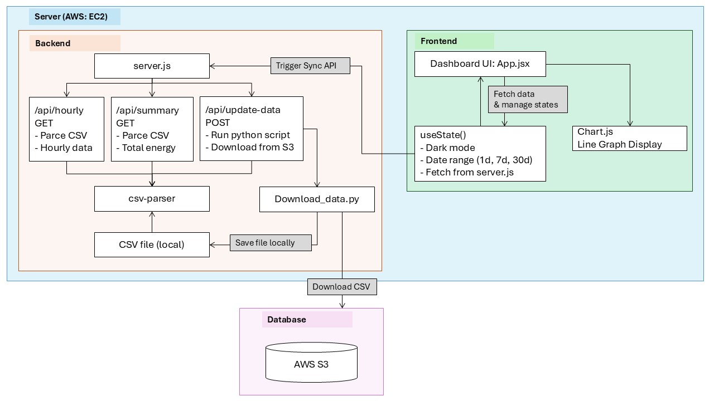

# Software Architecture

## Overview

The Smart Power Meter Dashboard is a full-stack web application designed to monitor and visualize real-time electricity consumption data. The system integrates cloud storage, automated data processing, and an interactive web interface to provide comprehensive energy usage analytics.

## System Architecture

### Architecture Diagram



## Technology Stack

### Frontend
| Technology | Purpose |
|------------|---------|
| React 18.x | Modern UI framework with hooks |
| Chart.js & react-chartjs-2 | Interactive data visualization |
| Tailwind CSS | Utility-first CSS framework |
| Vite | Fast build tool and development server |

### Backend
| Technology | Purpose |
|------------|---------|
| Node.js | Server-side JavaScript runtime |
| Express.js | Web application framework |
| csv-parser | CSV file processing library |
| Python | Data processing and AWS integration |

### Cloud Services
| Technology | Purpose |
|------------|---------|
| AWS EC2 | Virtual server hosting |
| Amazon S3 | Object storage for CSV data files |
| IAM Roles | Access control and security |
| AWS SDK (boto3) | Cloud service integration |

### Development Tools
| Technology | Purpose |
|------------|---------|
| Concurrently | Run multiple processes simultaneously |
| Autoprefixer & PostCSS | CSS processing |
| ES6 Modules | Modern JavaScript module system |

## Project Structure

```
electric-meter-final-all-integrated/
├── client/                    # React frontend application
│   ├── src/
│   │   ├── App.jsx           # Main dashboard component
│   │   ├── main.jsx          # React entry point
│   │   └── index.css         # Tailwind CSS imports
│   ├── public/               # Static assets
│   ├── node_modules/         # Frontend dependencies
│   ├── index.html            # HTML template
│   ├── package.json          # Frontend dependencies
│   ├── package-lock.json     # Dependency lock file
│   ├── vite.config.js        # Vite configuration
│   ├── postcss.config.js     # PostCSS configuration
│   └── tailwind.config.js    # Tailwind configuration
├── scripts/                  # Python utilities
│   └── download_data.py      # AWS S3 data synchronization
├── public/                   # Backend static files
│   └── main_branch_1/        # Local CSV data storage
├── node_modules/             # Backend dependencies
├── server.js                 # Express.js backend server
├── package.json              # Backend dependencies
├── package-lock.json         # Backend dependency lock file
└── README.md
```

## Key Features

### 1. Real-time Data Visualization
- **Hourly Energy Consumption Charts** - Interactive line charts showing kWh usage
- **Time Range Selection** - View data for 1 day, 7 days, or 30 days
- **Dark/Light Mode** - User-customizable interface themes

### 2. Data Processing Pipeline
- **CSV Processing** - Converts raw meter data into structured format
- **Time-based** - Groups data by hourly intervals

### 3. Cloud Integration
- **S3 Data Synchronization** - Automatically fetches latest CSV files
- **Python-based AWS Integration** - Boto3 SDK for cloud operations

## Cloud Services

### AWS EC2
**Why chosen:** Full control over runtime environment, better than serverless for combined frontend/backend hosting  
**Implementation:** Hosts both React frontend and Node.js backend on single instance

### Amazon S3
**Why chosen:** Cost-effective storage for CSV files, better than databases for simple time-series data  
**Implementation:** Stores CSV files in `powerdata-test-1` bucket with incremental sync

### IAM Roles
**Why chosen:** More secure than hardcoded credentials, follows AWS security best practices  
**Implementation:** Read-only S3 access for Python script, prevents unauthorized data changes

## API Endpoints

### GET /api/summary
Returns daily total energy consumption for all available data files.

**Response Format:**
```json
[
  {
    "filename": "2024-01-15.csv",
    "total_energy": 45.234
  }
]
```

### GET /api/hourly
Returns hourly energy consumption data with timestamps.

**Response Format:**
```json
[
  {
    "datetime": "2024-01-15 14:00",
    "kWh": 2.145
  }
]
```

### POST /api/update-data
Triggers Python script to download latest data from AWS S3.

**Response Format:**
```json
{
  "status": "success",
  "output": "Download completed. Total: 5, Skipped: 2"
}
```
